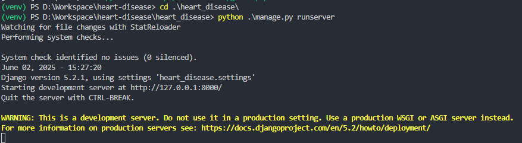

# Heart Disease Prediction Web Application

Ứng dụng web dự đoán bệnh tim mạch sử dụng Django và Machine Learning.

## Cấu trúc dự án
```
bash git clone https://github.com/nemeryous/heart-disease.git
```


```
heart-disease/
├── heart_disease/          # Django project
│   ├── models/            # Thư mục chứa model ML
│   ├── prediction/        # Django app xử lý dự đoán
│   ├── heart_disease/     # Django project settings
│   └── manage.py          # Django management script
└── client/               # Frontend code
    ├── index.html        # Giao diện người dùng
    ├── main.js           # JavaScript logic
    └── style.css         # CSS styles
```

## Yêu cầu hệ thống

- Python 3.8+
- pip (Python package manager)


## Cài đặt

### 1. Cài đặt môi trường Python

```bash
# Tạo môi trường ảo
python -m venv venv

# Kích hoạt môi trường ảo
# Windows
venv\Scripts\activate

# Linux/Mac
source venv/bin/activate

# Cài đặt các thư viện cần thiết sử dụng requirements.txt
pip install -r requirements.txt
```

### 2. Cài đặt và chạy Django backend

```bash
# Di chuyển vào thư mục Django project
cd heart_disease

# Khởi động server
python manage.py runserver
```

Server Django sẽ chạy tại `http://localhost:8000`

### 3. Chạy frontend

```bash
# Di chuyển vào thư mục client
cd client

# Mở file index.html bằng trình duyệt
```

## Phân tích và huấn luyện model

1. Đặt dataset vào thư mục chính
2. Mở và chạy file Jupyter Notebook:

```bash
# Di chuyển vào thư mục models
cd heart_disease/models

# Khởi động Jupyter Notebook
jupyter notebook

# Mở file statistics.ipynb và chạy các cell theo thứ tự
```

File `statistics.ipynb` sẽ:
- Phân tích dữ liệu
- Huấn luyện model
- Lưu model đã huấn luyện tại `heart_disease/saved_models`
- Copy model đã huấn luyện qua `heart-disease/models`

## API Endpoints

- `POST /api/predict/`: Endpoint dự đoán bệnh tim
  - Input: JSON với các trường:
    ```json
    {
      "age": 63,
      "sex": 1,
      "cp": 3,
      "trestbps": 145,
      "chol": 233,
      "fbs": 1,
      "restecg": 0,
      "thalach": 150,
      "exang": 0,
      "oldpeak": 2.3,
      "slope": 0,
      "ca": 0,
      "thal": 1
    }
    ```
  - Output: JSON với kết quả dự đoán
    ```json
    {
      "prediction": 1,
      "confidence": "77%"
    }
    ```